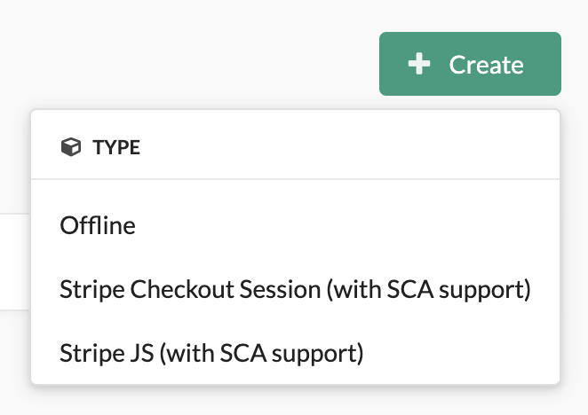

<p align="center">
    <a href="https://sylius.com" target="_blank">
        <picture>
          <source media="(prefers-color-scheme: dark)" srcset="https://media.sylius.com/sylius-logo-800-dark.png">
          <source media="(prefers-color-scheme: light)" srcset="https://media.sylius.com/sylius-logo-800.png">
          
        </picture>
    </a>
</p>

<h1 align="center">Payum Stripe Plugin</h1>

<p align="center">
    <a href="https://packagist.org/packages/flux-se/sylius-payum-stripe-plugin"></a>
    <a href="https://packagist.org/packages/flux-se/sylius-payum-stripe-plugin"></a>
    <a href="LICENSE"></a>
    <a href="https://github.com/FLUX-SE/SyliusPayumStripePlugin/actions?query=workflow%3A%22Build%22"></a>
</p>

<p align="center">
    <a href="https://sylius.com/plugins/" target="_blank">
        
    </a>
</p>

<p align="center">
    Integration of 
    <a href="https://stripe.com/" target="_blank">Stripe</a> 
    with 
    <a href="https://sylius.com" target="_blank">Sylius</a> 
    as a 
    <a href="https://github.com/Payum/Payum" target="_blank">Payum</a> 
    gateway.
</p>

<p align="center">
This plugin exposes two gateway flavors: Stripe Checkout Session (hosted checkout, with SCA support) and Stripe JS 
(Payment Intents with Stripe Elements), supporting one-time payments, authorized payments by placing a hold on a card, 
and refunds.
</p>

> ⚠️ **This plugin targets Sylius 1.x.**
> If you are looking for a Stripe integration for **Sylius 2.x**, please use the official
> [Sylius/StripePlugin](https://github.com/Sylius/StripePlugin) instead.

---

## Features

It supports [one time payment](https://stripe.com/docs/payments/accept-a-payment?integration=checkout)
and authorized payment by [placing a hold on a card](https://stripe.com/docs/payments/capture-later).

Refund is also possible but disabled by default to avoid mistakes, use this config to enable it :
```yaml
# config/packages/flux_se_sylius_payum_stripe.yaml

flux_se_sylius_payum_stripe:
    refund_disabled: false
```

See https://stripe.com/docs/payments/checkout for more information.

## Installation

Install using Composer :

```shell
composer remove --dev stripe/stripe-php
composer require flux-se/sylius-payum-stripe-plugin
```

> 💡 If the flex recipe has not been applied then follow the next step.

Enable this plugin:

```php
<?php

# config/bundles.php

return [
    // ...
    FluxSE\SyliusPayumStripePlugin\FluxSESyliusPayumStripePlugin::class => ['all' => true],    
    FluxSE\PayumStripeBundle\FluxSEPayumStripeBundle::class => ['all' => true],
    // ...
];
```

Create the file `config/packages/flux_se_sylius_payum_stripe.yaml` and add the following content

```yaml
imports:
  - { resource: "@FluxSESyliusPayumStripePlugin/Resources/config/config.yaml" }
```

## Configuration

### Sylius configuration

Go to the admin area, log in, then click on the left menu item "CONFIGURATION > Payment methods".
Create a new payment method type "Stripe Checkout Session (with SCA support)" :

<p align="center">
    
</p>

Then a form will be displayed, fill-in the required fields :

#### 1. the "code" field (ex: "stripe_checkout_session_with_sca").

> 💡 The code will be the `gateway name`, it will be needed to build the right webhook URL later
> (see [Webhook key](#webhook-key) section for more info).

#### 2. choose which channels this payment method will be affected to.

#### 3. the gateway configuration ([need info from here](#api-keys)) :

   ![Gateway Configuration][docs-assets-gateway-configuration]

   > _📖 NOTE1: You can add as many webhook secret keys as you need here, however generic usage need only one._

   > _📖 NOTE2: the screenshot contains false test credentials._

#### 4. give to this payment method a display name (and a description) for each language you need.

Finally, click on the "Create" button to save your new payment method.

### API keys

This plugin **requires a Restricted API Key** (`rk_test_…` / `rk_live_…`). Standard Stripe secret keys (`sk_*`) are 
no longer accepted.

**We recommend** installing the [Sylius Stripe App][link-sylius-stripe-app] - its Settings Page exposes both keys 
this plugin needs:

- the publishable key (`pk_test_…` / `pk_live_…`) for the "Publishable key" field,
- a Restricted API Key (`rk_test_…` / `rk_live_…`) for the "Restricted API key" field.

The App ships with the minimum scopes the plugin needs.

Restricted API keys are Stripe's officially recommended replacement for standard secret keys, see
[Stripe's documentation on restricted API keys][link-stripe-restricted-keys] for the full rationale.

### Webhook key

Got to :

https://dashboard.stripe.com/test/webhooks

Then create a new endpoint with those events:

 | Gateway | `stripe_checkout_session` | `stripe_js` |
|-|-|-|
| Webhook events |  - `checkout.session.completed`<br> - `checkout.session.async_payment_failed`<br> - `checkout.session.async_payment_succeeded`<br> - `setup_intent.canceled` (⚠️ Only when using `setup` mode)<br> - `setup_intent.succeeded`  (⚠️ Only when using `setup` mode) |  - `payment_intent.canceled`<br> - `payment_intent.succeeded`<br> - `setup_intent.canceled` (⚠️ Only when using `setup` mode)<br> - `setup_intent.succeeded`  (⚠️ Only when using `setup` mode) |


The URL to fill is the route named `payum_notify_do_unsafe` with the `gateway`
param equal to the `gateway name` (Payment method code), here is an example :

```
https://localhost/payment/notify/unsafe/stripe_checkout_session_with_sca
```

> 📖 As you can see in this example the URL is dedicated to `localhost`, you will need to provide to
> Stripe a public host name in order to get the webhooks working.

> 📖 Use this command to know the exact structure of `payum_notify_do_unsafe` route
> 
> ```shell
> bin/console debug:router payum_notify_do_unsafe
> ```

> 📖 Use this command to know the exact name of your gateway,
> or just check the `code` of the payment method in the Sylius admin payment method index.
> 
> ```shell
> bin/console debug:payum:gateway
> ```

### Test or dev environment

Webhooks are triggered by Stripe on their server to your server.
If the server is into a private network, Stripe won't be allowed to reach your server.

Stripe provide an alternate way to catch those webhook events, you can use
`Stripe cli` : https://stripe.com/docs/stripe-cli
Follow the link and install `Stripe cli`, then use those command line to get
your webhook key :

First login to your Stripe account (needed every 90 days) :

```shell
stripe login
```

Then start to listen for the Stripe events (minimal ones are used here), forwarding request to your local server :

1. Example with `stripe_checkout_session_with_sca` as gateway name:
   ```shell
   stripe listen \
      --events checkout.session.completed,checkout.session.async_payment_failed,checkout.session.async_payment_succeeded \
      --forward-to https://localhost/payment/notify/unsafe/stripe_checkout_session_with_sca
   ```
1. Example with `stripe_js_with_sca` as gateway name:
   ```shell
   stripe listen \
      --events payment_intent.canceled,payment_intent.succeeded \
      --forward-to https://localhost/payment/notify/unsafe/stripe_js_with_sca
   ```

> 💡 Replace the --forward-to argument value with the right one you need.

When the command finishes a webhook secret key is displayed, copy it to your Payment method
in the Sylius admin.

> ⚠️ Using the command `stripe trigger checkout.session.completed` will always result in a `500 error`,
> because the test object will not embed any usable metadata.

### More?

See documentation [here](https://github.com/FLUX-SE/PayumStripe/blob/master/README.md).

## API (Sylius API Platform)

### Stripe JS gateway

The endpoint : `GET /api/v2/shop/orders/{tokenValue}/payments/{paymentId}/configuration`
will make a Payum `Capture` or an `Authorize` and respond with the Stripe Payment Intent client secret, like this :

```json
{
 'publishable_key':  'pk_test_1234567890',
 'use_authorize': false,
 'stripe_payment_intent_client_secret': 'a_secret'
}
```

After calling this endpoint your will be able to use Stripe Elements to display a Stripe Payment form, the same as this template is doing it:
https://github.com/FLUX-SE/PayumStripe/blob/master/src/Resources/views/Action/stripeJsPaymentIntent.html.twig.
More information here : https://docs.stripe.com/payments/payment-element

### Stripe Checkout Session gateway

The endpoint : `GET /api/v2/shop/orders/{tokenValue}/payments/{paymentId}/configuration`
will make a Payum `Capture` or an `Authorize` and respond with the Stripe Checkout Session url, like this :

```json
{
 'publishable_key':  'pk_test_1234567890',
 'use_authorize': false,
 'stripe_checkout_session_url': 'https://checkout.stripe.com/c/pay/cs_test...'
}
```

Since this endpoint is not able to get any data from you, a service can be decorated to specify the Stripe Checkout Session `success_url` you need. 
Decorate this service : `flux_se.sylius_payum_stripe.api.payum.after_url.stripe_checkout_session` to generate your own dedicated url.
You will have access to the Sylius `Payment` to decide what is the url/route and the parameters of it.

## Security issues

If you think that you have found a security issue, please do not use the issue tracker and do not post it publicly.
Instead, all security issues must be sent to `security@sylius.com`

## Community

For online communication, we invite you to chat with us and other users on [Sylius Slack](https://sylius.com/slack).

## Authors

This plugin was originally created by:

<a href="https://harman.com" target="_blank"></a>
&nbsp;&nbsp;
<a href="https://flux.audio" target="_blank"></a>

Kudos to [Prometee](https://github.com/Prometee) and [all contributors](../../contributors) 🙏

## License

This plugin is released under the [MIT License](LICENSE).

## Telemetry

This plugin enforces telemetry data collection when used with Sylius.
Details are described in [TELEMETRY_POLICY.md](./TELEMETRY_POLICY.md).

[docs-assets-create-payment-method]: docs/assets/create-payment-method.png
[docs-assets-gateway-configuration]: docs/assets/gateway-configuration.png

[ico-version]: https://img.shields.io/packagist/v/Flux-SE/sylius-payum-stripe-plugin.svg?style=flat-square
[ico-total-downloads]: https://img.shields.io/packagist/dt/Flux-SE/sylius-payum-stripe-plugin.svg?style=flat-square
[ico-license]: https://img.shields.io/badge/license-MIT-brightgreen.svg?style=flat-square
[ico-github-actions]: https://github.com/FLUX-SE/SyliusPayumStripePlugin/workflows/Build/badge.svg

[link-packagist]: https://packagist.org/packages/flux-se/sylius-payum-stripe-plugin
[link-total-downloads]: https://packagist.org/packages/flux-se/sylius-payum-stripe-plugin
[link-github-actions]: https://github.com/FLUX-SE/SyliusPayumStripePlugin/actions?query=workflow%3A"Build"
[link-sylius-stripe-app]: https://marketplace.stripe.com/apps/install/link/com.sylius.stripe
[link-stripe-restricted-keys]: https://docs.stripe.com/keys/restricted-api-keys
